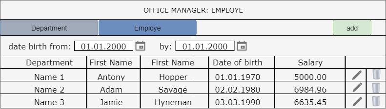

# Office Manager
# Table of contents
* [Introduction](#introduction)
  * [Purpose](#purpose)
  * [Product Scope](#product-scope)
* [Overall Description](#overall-description)
  * [Product Perspective](#product-perspective)
  * [Product Functions](#product-functions)
  * [User Classes and Characteristics](#user-classes-and-characteristics)
  * [Operating Environment](#operating-environment)
  * [User Documentation](#user-documentation)
  * [Assumptions and Dependencies](#assumptions-and-dependencies)
* [External Interface Requirements](#external-interface-requirements)
  * [User Interfaces](#user-interfaces)
  * [Hardware Interfaces](#hardware-interfaces)
  * [Software Interfaces](#software-interfaces)
  * [Communications Interfaces](#communications-interfaces)
* [System Features](system-features)
  * [Department Area](#department-area)
  * [Employe Area](#employe-area)
* [Other Non-Functional Requirements](#other-non-functional-requirements)
  * [Performance Requirements](#performance-requirements)
  * [Safety Requirements](#safety-requirements)
  * [Security Requirements](#security-requirements)
  * [Software Quality Attributes](#software-quality-attributes)
  * [Business Rules](#business-rules)
* [Appendix A: Glossary](#appendix-a-glossary)
* [Appendix B: Analysis Models](#appendix-b-analysis-models)

# Introduction 

## Purpose

The puspose of this document is to represent the Office Manager Web Application. This document explains the system's software requirements of the project. The purpose of the application is to simplify the process of managing departments and employees.

## Product Scope

This application will use a database of a company which includes tables of departments and employees of these. The application will allow to perform basic operation for management the employees.

# Overall Description 

# Product Perspective

No perspective =)

# Product Functions

Office Manager will provide the following functions:
* display list of departments
* display list of employees
* add/edit/delete department/employe information

# User Classes and Characteristics

## Operating Environment

The application can be run on any internet browser.

## User Documentation

_List the user documentation components (such as user manuals, on-line help, and tutorials) that will be delivered along with the software. Identify any known user documentation delivery formats or standards._

# External Interface Requirements 

## User Interfaces

There are no external user interface requirements.

## Hardware Interfaces

There are no external hardware interface requirements.

## Software Interfaces

There are no external software interface requirements.

## Communications Interfaces

There are no external communication interface requirements.

## System Features

### Department area

1 Display list of departments
* User click the tab "Department"
* Application display list of existing departments

Pic.1.1

The list displays the following columns:
* Department name - unique department name
* Average salary - automatically calculated
* Count of employees - total number of department employees
Aggregate function: Average salary = total salary of all employees for three months / count of employees

2 Add department

2.1 Main scenario
* User cliack "add" button
* Application displays form to enter name of new department
* User enter department name and press "Save" button
* If name of department is entered incorrectly, message is displayed
* If name is valid, then record is adding to database
* If error occurs, then error message is displaying
* If new department is successfully added, then list of departments with added record is displaying

2.2 Cancel scenario
* User cliack "add" button
* Application displays form to enter name of new department
* User enter department name and press "Cancel" button
* New department don't save in database

Pic.1.2

When adding a department, entered name of new department.

3 Edit department

3.1 Main scenario
* User click the "Edit" button
* Application displays form to edit name of department
* User enter a new name either makes no changes and click "Save" button
* If name of department is entered incorrectly, message is displayed
* If name is valid, then edited record is adding to database
* If error occurs, then error message is displaying
* If edited record is successfully added, then list of departments with edited record is displaying

3.2 Cancel scenario
* User click the "Edit" button
* Application displays form to edit name of department
* User enter a new name either makes no changes and click "Cancel" button
* Edited record don't save in database

Pic.1.3

Data validation:
* Name - maximum length of 200 characters

4 Removing the department

4.2 Main scenario
* User click "Remove" button in the corresponding line
* Application display a confirmation dialog
* User click "Confirm"
* Record is deleted from database
* If errors occurs, then error message displayed
* If record successfully deleted, then list of departments without deleted record is displaying

4.3 Cancel scenario
* User click "Remove" button in the corresponding line
* Application display a confirmation dialog
* User click "Cancel"
* Record didn't delete from database
* List of departments without changes is displaying

Pic.1.4

### Employe area

# Other Non-Functional Requirements 
---
## Performance Requirements

## Safety Requirements

## Security Requirements

## Software Quality Attributes

## Business Rules

# Appendix A: Glossary

# Appendix B: Analysis Models
