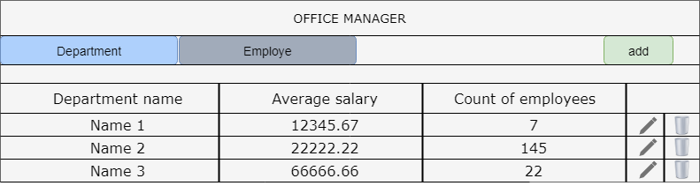
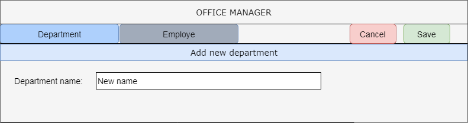
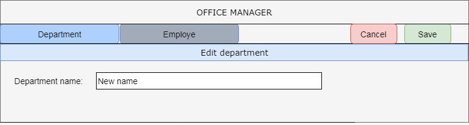
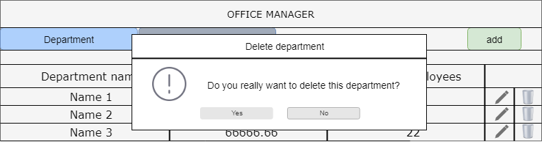
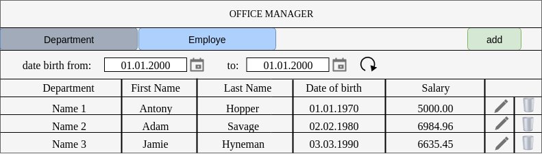
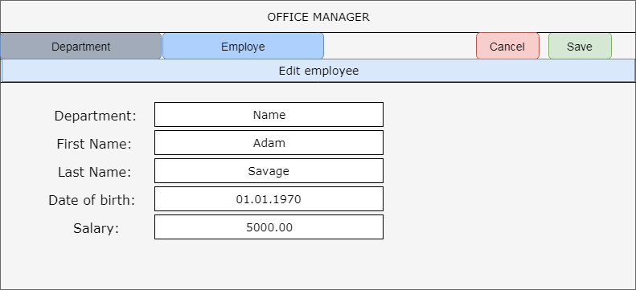
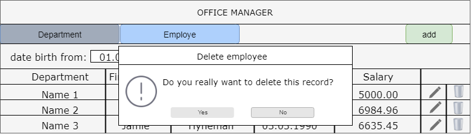

# Office Manager
# Table of contents
* [Introduction](#introduction)
  * [Purpose](#purpose)
  * [Product Scope](#product-scope)
* [Overall Description](#overall-description)
  * [Product Perspective](#product-perspective)
  * [Product Functions](#product-functions)
  * [User Classes and Characteristics](#user-classes-and-characteristics)
  * [Operating Environment](#operating-environment)
  * [User Documentation](#user-documentation)
  * [Assumptions and Dependencies](#assumptions-and-dependencies)
* [External Interface Requirements](#external-interface-requirements)
  * [User Interfaces](#user-interfaces)
  * [Hardware Interfaces](#hardware-interfaces)
  * [Software Interfaces](#software-interfaces)
  * [Communications Interfaces](#communications-interfaces)
* [System Features](system-features)
  * [Department Area](#department-area)
  * [Employee Area](#employee-area)
* [Other Non-Functional Requirements](#other-non-functional-requirements)
  * [Performance Requirements](#performance-requirements)
  * [Safety Requirements](#safety-requirements)
  * [Security Requirements](#security-requirements)
  * [Software Quality Attributes](#software-quality-attributes)
  * [Business Rules](#business-rules)
* [Appendix A: Glossary](#appendix-a-glossary)
* [Appendix B: Analysis Models](#appendix-b-analysis-models)

# Introduction 

## Purpose

The puspose of this document is to present the Office Manager Web Application. The application is designed to simplify the process of managing departments and employees.

## Product Scope

This application will work with a company database constisting of two tables: departments and employees. The application will allow to perform basic operations with the abovementioned database.

# Overall Description 

# Product Perspective

No perspective =)

# Product Functions

Office Manager will provide the following functions:
* displaying list of departments
* displaying list of employees
* adding/editing/deleting department/employee information

## User Classes and Characteristics

This project is intended for use by managers and HR specialists.

## Operating Environment

When developing this application, the following will be used:
* Ubuntu 18.04 LTS
* Python 3.7.3
* Django 2.2
* MySQL

## User Documentation

TODO.

# External Interface Requirements 

## User Interfaces

There are no external user interface requirements.

## Hardware Interfaces

There are no external hardware interface requirements.

## Software Interfaces

There are no external software interface requirements.

## Communications Interfaces

There are no external communication interface requirements.

## System Features

### Department area

1 Displaying list of departments
Main scenario
* User clicks the "Department" tab
* Application displays list of existing departments

Fig.1.1

There are following columns:
* Department name - unique department name;
* Average salary - automatically calculated;
* Number of employees - total of department employees.

Aggregate function: Average salary = total salary of employees / total number of employees

2 Adding department record

2.1 Main scenario
* User clicks the "add" button;
* Application displays form for entering data;
* User enters the department name and press the "Save" button;
* If the department name is incorrect, a message will be displayed;
* If the name is valid, then a record will be added to database;
* If an error occurs, then an error message will be displayed;
* If a new department is successfully added, then a list of departments with the added record will be displayed.

2.2 Canceling scenario
* User clicks the "add" button;
* Application displays form for entering data;
* User enters the department name and press the "Cancel" button;
* A record about the new department will not be stored in database;
* Application displays a list of departments without the abovementioned record.

Fig.1.2

Fields required when adding a new department:
* Department name

Data validation:
* Name - maximum length of 200 characters.

3 Editing department record

3.1 Main scenario
* User clicks the "Edit" button;
* Application displays form for editing data;
* User enters a new name either makes no changes and clicks the "Save" button;
* If the department name is incorrect, a message will be displayed;
* If the name is valid, then a record will be changed and stored in database;
* If an error occurs, then an error message will be displayed;
* If the edited record is successfully added, then a list of departments with changes will be displayed.

3.2 Canceling scenario
* User clicks the "Edit" button;
* Application displays form for editing data;
* User enters a new name either makes no changes and clicks the "Cancel" button;
* The edited record won't be stored in database;
* List of departments without changes will be displayed.

Fig.1.3

4 Deleting department record

4.2 Main scenario
* User clicks the "Delete" button in the corresponding line;
* Application displays a popup box;
* User clicks the "Yes" button;
* Record will be deleted from database;
* If an error occurs, then an error message will be displayed;
* If the record is successfully deleted, then a list of departments with changes will be displayed.

4.3 Canceling scenario
* User clicks the "Delete" button in the corresponding line;
* Application displays a popup box;
* User clicks the "No" button;
* Record will not be deleted from database;
* List of departments without changes will be displayed.

Fig.1.4

### Employee area

1 Displaying list of employees

Main scenario
* User clicks the "Employee" tab;
* Application displays list of all employees.

Fig.1.5

There are following columns:
* Department - employee's department;
* First name - employee's first name;
* Second salary - employee's second name;
* Date of birth - employee's date of birth;
* Salary - employee's salary.

2 Filtering by date of birth

2.1 Main scenario
* User sets the date value in the "from" and "to" fields and clicks the "Refresh" button;
* Application displays a list of employees with the date of birth in specified period.

2.2 Only the "from" field
* User sets the date value in the "from" field and clicks the "Refresh" button;
* Application displays a list of employees with the date of birth which is greater than the date specified in the "from" field (limits included).

2.3 Only the "to" field
* User sets the date value in the "to" field and clicks the "Refresh" button;
* Application displays a list of employees with the date of birth which is smaller than the date specified in the "to" field (limits included).

3 Adding employee record

3.1 Main scenario
* User clicks the "add" button;
* Application displays form for entering data;
* User enters the employee's name and press the "Save" button;
* If the entered data are incorrect, a message will be displayed;
* If the data are valid, then a record will be added to database;
* If an error occurs, then an error message will be displayed;
* If a new employee is successfully added, then a list of employees with the added record will be displayed.

3.2 Canceling scenario
* User clicks the "add" button;
* Application displays form for entering data;
* User enters the required data and press the "Cancel" button;
* A record about the new employee will not be stored in database;
* Application displays a list of employees without the abovementioned record.

Fig.1.2

When adding an employee, the following fields are available:
* Department - selected from drop-down list;
* First name - employee's first name;
* Second name - employee's second name;
* Date of birth - employee's date of birth;
* Salary - employee's salary.

Data validation:
* First name - maximum length of 100 characters;
* Second name - maximum length of 100 characters;
* Date of birth - in format dd.mm.yyyy;
* Salary - decimal number with 2 decimal places.

4 Editing employee record

4.1 Main scenario
* User clicks the "Edit" button;
* Application displays form for editing data;
* User enters a new data either makes no changes and clicks the "Save" button;
* If the data is incorrect, a message will be displayed;
* If the name is valid, then a record will be changed and stored in database;
* If an error occurs, then an error message will be displayed;
* If the edited record is successfully added, then a list of employees with changes will be displayed.

4.2 Canceling scenario
* User clicks the "Edit" button;
* Application displays form for editing data;
* User enters a new data either makes no changes and clicks the "Cancel" button;
* The edited record won't be stored in database;
* List of employees without changes will be displayed.

Fig.1.3

Data validation:
* TODO
* TODO
* TODO

5 Deleting employee record

5.2 Main scenario
* User clicks the "Delete" button in the corresponding line;
* Application displays a popup box;
* User clicks the "Yes" button;
* Record will be deleted from database;
* If an error occurs, then an error message will be displayed;
* If the record is successfully deleted, then a list of employees with changes will be displayed.

5.3 Canceling scenario
* User clicks the "Delete" button in the corresponding line;
* Application displays a popup box;
* User clicks the "No" button;
* Record will not be deleted from database;
* List of employees without changes will be displayed.

Fig.1.4

# Other Non-Functional Requirements 
---
## Performance Requirements

## Safety Requirements

## Security Requirements

## Software Quality Attributes

## Business Rules

# Appendix A: Glossary

# Appendix B: Analysis Models
